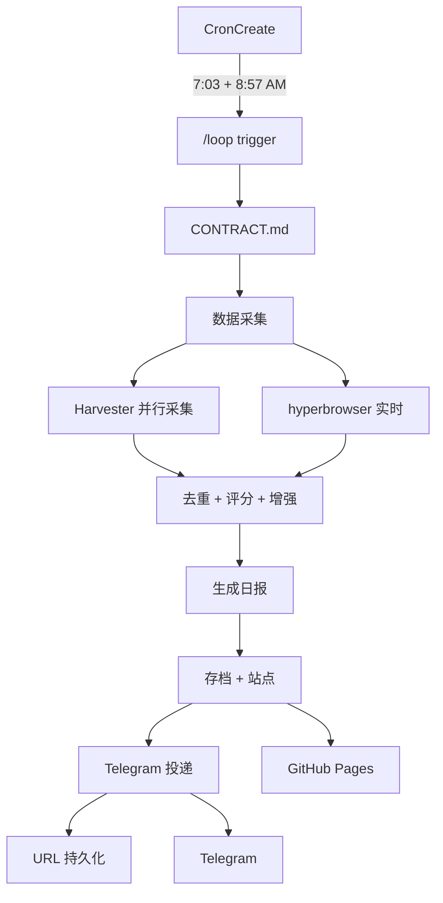

<p align="center">
  
  
  
  
</p>

<h1 align="center">📰 每日 AI 科技日报</h1>

<p align="center">
  <strong>全自动 AI 新闻采集 → 中文日报撰写 → Telegram 投递 → 站点存档</strong><br>
  每天 7:03 AM 自动运行，零人工干预。多源并行 + 4 维评分 + 三层去重。<br>
  <a href="https://thewher.github.io/daily/"><strong>🌐 在线站点 »</strong></a>
</p>

---

## ⚡ 产出样例

```
📰 每日 AI 科技日报 — 2026年6月22日

• Samsung 全员部署 ChatGPT Enterprise + Codex — OpenAI 史上最大企业交易
  💡 韩企 AI 军备竞赛全面加速
  🔗 https://the-decoder.com/samsung-rolls-out-chatgpt...

• Sakana AI 的 Fugu 多 LLM 编排达到 Fable/Mythos 基准
  💡 scaling 护城河面临「组合式竞争」侵蚀

• OpenAI Codex「Record & Replay」— 录一次，AI 替你做一辈子
  💡 白领自动化从事务级下降到操作级

🔥 GitHub Trending: affaan-m/ECC (+1,417/d) · vercel/eve (+368/d)
💬 社区: HN · V2EX · LinuxDo
📄 论文: HuggingFace Daily Papers
🆕 产品: Product Hunt AI

🤖 autoloop follow-news v3.23
```

---

## 🏗️ 架构



**合约自修订**：CONTRACT.md 每次执行后更新 Current State + Revision Log，无需改 CronCreate。

---

## 🚀 快速开始

```bash
# 1. 克隆
git clone https://github.com/TheWher/follow-news.git
cd follow-news

# 2. 安装依赖（纯标准库，无需 pip install）

# 3. 采集数据（4 源并行，替换旧 shell 脚本）
python -m scripts.harvester              # 全源采集
python -m scripts.harvester --list-sources  # 查看可用源

# 4. 生成站点
python -m scripts.site_builder           # 全部日期
python -m scripts.site_builder 2026-07-23  # 单日
# → site/index.html 可直接浏览

# 5. 运行测试
python tests/run_all.py
```

> **兼容性说明**：旧的 `scripts/fetch-*.sh` 和 `python3 scripts/build-enhanced-site.py` 仍可用，它们是薄封装层。

---

## ✨ 特性

| 特性 | 说明 |
|------|------|
| 🔄 **多源轮换** | 4 级数据源自动轮换（pipeline → TechCrunch → Techmeme → random pool），同天重跑不重复 |
| ⚡ **并行采集** | Harvester 4 路 `ThreadPoolExecutor` 并行抓取，总耗时 ≈ 最慢源 |
| 🧠 **AI 评分** | 4 维度 0-10 自动评分（MUST_INCLUDE / GOOD / MAYBE / SKIP），宁缺毋滥 |
| 🔗 **URL 去重** | 三层去重：URL 精确匹配 + 标题相似度 + 同域关键词。跨天 7 天持久化 |
| 📊 **diff 模式** | 同天内第 N 版仅展示新增/排名变化的条目，无新增则标注「与上版相同」 |
| 📡 **Telegram 投递** | `messages_send` MCP 直发，4 分条（≤3500 字符/条），秒到 |
| 🌐 **增强站点** | 纯客户端搜索 + 书签（localStorage）+ 已读跟踪 + 分类筛选 + 移动端适配 |
| 🗄️ **日/周归档** | 每日存档 + 周日自动合成 Top 10 周报（零额外 LLM 成本） |
| 💾 **持久化缓存** | `cache/` 目录跨会话保留，12 小时内固定层直接复用，免重复抓取 |
| 🧪 **回归测试** | 1202 项 smoke test，覆盖解析器 + 去重引擎，`python tests/run_all.py` |
| 🔧 **可移植** | 路径自动推断 + 环境变量覆盖，克隆即用，不依赖 WSL 硬编码 |

---

## 📂 项目结构

```
.
├── config/
│   ├── project_paths.py                # 集中路径层（env 覆盖）
│   ├── follow-news-sources.json        # GitHub 监控源
│   └── follow-news-topics.json         # 话题配置
├── scripts/
│   ├── harvester/                      # 配置驱动采集器（← v3.23 新）
│   │   ├── __init__.py                 # CLI + 并行调度
│   │   ├── base.py                     # HTTP·JSON·日志·输出
│   │   └── handlers/
│   │       ├── community.py            # HN + V2EX + LinuxDo
│   │       ├── github.py               # GitHub 5 维搜索
│   │       ├── papers.py               # HF + PapersWithCode
│   │       └── products.py             # PH + GitHub 新仓库
│   ├── site_builder/                   # 模块化站点生成器（← v3.23 新）
│   │   ├── parser.py                   # Markdown 解析（3 格式兼容）
│   │   ├── assets.py                   # CSS + JS
│   │   ├── templates.py                # HTML 拼装
│   │   └── builder.py                  # 构建主循环
│   ├── build-enhanced-site.py          # 薄封装（向后兼容）
│   ├── build-pages-site.py             # 薄封装（向后兼容）
│   ├── dedup-articles.py               # 去重引擎
│   ├── score-articles.py               # AI 评分
│   ├── enrich-articles.py              # 背景增强
│   ├── fetch-github-trending.sh        # 旧版 shell（保留兼容）
│   ├── fetch-community.sh
│   ├── fetch-papers.sh
│   ├── fetch-products.sh
│   └── follow-news-pipeline.sh         # 旧版管道（保留兼容）
├── tests/                              # 测试目录（← v3.23 新）
│   ├── test_parser.py                  # 解析器回归（23 文件全覆盖）
│   ├── test_dedup.py                   # 去重引擎单元测试
│   └── run_all.py                      # 聚合运行器
├── cache/                              # 持久化缓存（跨会话）
├── archive/follow-news/                # 历史日报（14 天+）
├── site/                               # GitHub Pages 站点
├── CONTRACT.md                         # autoloop 合约（SSoT，自修订）
└── .used-urls.json                     # 跨天 URL 去重状态
```

---

## 🔧 数据源

| 层级 | 来源 | 采集方式 |
|------|------|----------|
| 新闻 (主) | pipeline 多源 / TechCrunch / Decoder / Techmeme / Bing News | shell pipeline + hyperbrowser 实时 |
| GitHub | GitHub REST API（5 维查询） | `harvester/handlers/github.py` |
| 社区 | Hacker News / V2EX / LinuxDo | `harvester/handlers/community.py` |
| 论文 | HuggingFace Daily Papers | `harvester/handlers/papers.py` |
| 产品 | Product Hunt RSS + GitHub 新仓库 | `harvester/handlers/products.py` |

---

## 🧪 测试

```bash
# 运行全部测试
python tests/run_all.py

# 单独运行
python tests/test_parser.py    # 解析器：归档回归 + 边界条件
python tests/test_dedup.py     # 去重引擎：URL·域·相似度
```

覆盖率：核心路径（解析器 + 去重）全覆盖，总计 1202 项断言。

---

## 🤝 贡献

```bash
1. Fork → Branch（`feature/your-feature`）
2. 改动合约逻辑 → 改 CONTRACT.md 的 Execution Contract 部分
3. 添加数据源 → 在 harvester/handlers/ 新增模块 + @register 装饰器
4. 改动站点 → 在 site_builder/ 对应模块修改（parser/assets/templates）
5. 运行测试 → python tests/run_all.py
6. 提交 PR（描述改动 + 影响）
```

---

## 📜 License

MIT

---

<p align="center">
  <a href="https://star-history.com/#TheWher/follow-news&Date">
    
  </a>
</p>
